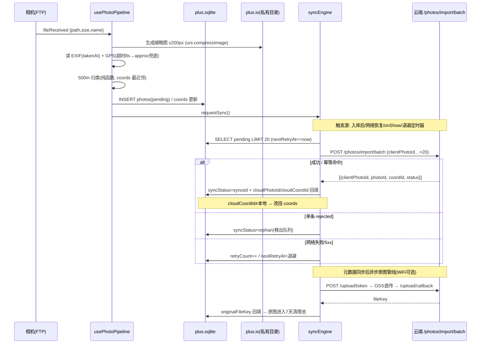

# 阶段②a 数据层设计 — App 照片本地存储与云端同步管线

> 本文档为"阶段②：相机 FTP 直传手机热点"第二阶段的数据层设计稿。
> 前置：《阶段②_UTS插件设计文档.md》（文件接收）、《api.md》v2.0（云端接口清单）。
> 本轮**只设计不编码**，供阶段②a 编码完成后接入时落地。
> 状态：**待王总/架构评审确认**，确认后冻结字段契约与模块划分。

---

## 1. 文档信息

| 项目 | 内容 |
|---|---|
| 文档名称 | 阶段②_App照片数据管线设计.md |
| 版本 | v0.9（草案） |
| 日期 | 2026-08-09 |
| 适用范围 | uni-app App 端（Android 优先，plus.* API 平台守卫） |
| 关联工程 | `uni-preset-vue-vite/src/`（uni-app 工程）+ 仓库根目录 H5 原型（比对基线） |
| 数据流主线 | 相机 FTP → 原图落盘 → 读 GPS/EXIF → 500m 归类 → 本地 SQLite → 联网批量同步云端 |

### 1.1 已确认事实（本设计依据）

- 照片经 `ftp-receiver` UTS 插件 `fileReceived` 事件到达，携带 `{path, size, name}`，原图（含 CR3 20–60MB）已落应用私有目录（filesDir，无需存储权限）。
- 归类管线只消费**缩略图（≤200px）+ 元数据**；原图后续异步处理。
- H5 原型已用 Dexie(IndexedDB) 实现同类闭环，表 `pendingPhotos` 字段契约成熟（单一事实源，见 memo-home.html L7312）。
- **uni-app App 端无 IndexedDB/Dexie**，本地存储需重新选型。
- 云端接口规划：`POST /photos/import`（原子幂等，clientPhotoId 唯一键 + 网格锁）、`POST /photos/import/batch`（离线批量同步）、`GET /map/markers`（聚合展示）。
- 硬约束：不改变主产品 UI；H5 原型逻辑（页面/数据展示）不动，App 端数据层与其"字段契约对齐、算法复用"。

---

## 2. 本地存储选型结论

### 2.1 候选方案对比（2026-08 调研现状）

| 方案 | 容量 | 查询能力 | 事务 | 平台可用性 | 大文件适用 | 结论 |
|---|---|---|---|---|---|---|
| `uni.setStorage`（App 映射 plus.storage） | App 无硬上限，但**单条建议 ≤100KB**，值序列化为字符串 | 无 | 无 | H5/小程序/App | ❌ 2MB 即可能内存溢出；iOS 有静默写入失败 | 只放 token/配置 |
| `plus.storage`（直接调用） | 同 uni.setStorage | 无 | 无 | 仅 App | ❌ | 同上 |
| **`plus.sqlite`（HTML5+ 原生 API）** | 设备磁盘，无限制 | SQL：WHERE/ORDER/LIMIT/索引 | ✅ 完整 | **仅 App（H5 报 plus is not defined，需 #ifdef 守卫）** | ⚠️ 只存路径/元数据，不存二进制 | ★ 元数据 + 同步队列 |
| DCloud 插件市场 SQLite UTS 插件（id 26620 / 28293） | 同 SQLite | ORM + runSql + 事务 | ✅ | App + Harmony + web | ⚠️ 同上 | 备选：需鸿蒙/web 或想要 ORM 时 |
| `plus.io` / `uni.getFileSystemManager` | 设备磁盘（私有目录） | 无查询，按路径 IO | — | 仅 App（H5 部分能力） | ✅ 二进制/大文件首选 | ★ 原图/缩略图文件层 |
| KV 类插件（localforage 等社区移植） | 依赖实现 | 无 | 部分 | 跨端 | ❌ | 不推荐，绕开原生能力 |

关键事实（调研确认）：
- **plus.sqlite 是 HTML5+ 内置 API，无需任何插件**即可在打包后的 App 使用（`plus.sqlite.openDatabase({name, path:'_doc/xx.db'})`），支持事务与预置数据库；数据不会被系统清理（优于 WebSQL/IndexedDB 在 iOS 低存储时的被清风险）。
- 官方 UTS SQLite 插件（插件市场 id 26620、28293）是 ORM 包装，最新 1.0.8（2026-07）已支持 selectRows/insertRow/batchCrud 等结构化 CRUD，适用于 uni-app x/鸿蒙/web；本项目是 uni-app（Vue3），`plus.sqlite` 原生直用零依赖。
- 批量写入瓶颈在 JS↔原生通信，单条循环 1000 次在低端安卓可超 8s —— 必须用事务或单语句多值 INSERT。

### 2.2 推荐方案

```
┌─────────────────────────────────────────────────────────────┐
│  存储分层（App 端）                                          │
│                                                             │
│  plus.sqlite（内置，零依赖）                                  │
│    ├─ photos 表   照片元数据 + 同步状态（待同步队列）          │
│    ├─ coords 表   坐标点镜像 + 分类锚点                       │
│    └─ app_meta 表 管线状态 KV（schema 版本/退避/策略开关）      │
│                                                             │
│  plus.io 文件系统（私有目录，无权限申请）                       │
│    ├─ ftp/photos/   原图（CR3/JPEG，UTS 插件落盘，只读消费）    │
│    └─ ftp/thumbs/   缩略图 ≤200px JPEG（归类管线产物）         │
│                                                             │
│  uni.setStorage     用户 token、wifiOnly 开关等极轻量配置      │
└─────────────────────────────────────────────────────────────┘
```

**推荐理由**（对应评估维度）：

1. **容量**：照片元数据 + 待同步队列是"结构化、行数可控（千级）、字段小"的数据，SQLite 容量等同设备磁盘，无上限焦虑；大文件（原图/缩略图）全部走文件系统，SQLite 只存路径，规避 base64 膨胀 33% 与 KV 序列化崩溃。
2. **查询能力（500 米距离归类）**：数据量级（坐标点数百、照片数千）下不需要空间索引；SQLite 提供 `lng/lat` 索引 + 应用启动时一次性载入 coords 到内存做最近邻即可（O(n) 毫秒级）。`syncStatus` 索引支撑"取待同步批量"查询。
3. **跨端一致性**：App 用 SQLite、H5 用 IndexedDB，**数据层各自实现、字段契约完全一致**（clientPhotoId/lng/lat/takenAt/gpsSource/dateStr/timeStr/hour 对齐 H5 pendingPhotos），归类算法提取为纯函数双端共用同一套语义（第 5 章）。
4. **离线优先**：SQLite 数据不随系统清理（优于 IndexedDB/WebSQL）；plus.io 私有目录无存储权限依赖；同步全程以本地库为准，网络只在触发时被查询。
5. **零依赖务实**：不装第三方 SQLite 插件即可获得事务 + SQL；UTS 插件保留为"未来要鸿蒙/web 端"的升级路径，接口封装层（db.ts）预留替换点。

**不建议的场景**：把缩略图 base64 dataURL 直接存进 SQLite（查询拖慢 + 库文件膨胀）；把原图搬进任何 KV 存储（必炸内存）。

---

## 3. 表结构与字段契约

### 3.1 photos 表（照片元数据 + 待同步队列）

```sql
CREATE TABLE IF NOT EXISTS photos (
  clientPhotoId   TEXT PRIMARY KEY,              -- 幂等键（跨重试稳定，见 3.3）
  filePath        TEXT NOT NULL,                 -- 原图绝对路径（filesDir/ftp/photos/…）
  fileName        TEXT NOT NULL,                 -- 原文件名（含扩展名）
  fileSize        INTEGER NOT NULL,              -- 字节数（与 fileReceived.meta.size 一致）
  thumbPath       TEXT,                          -- 缩略图文件路径（_doc 相对路径）；生成失败为 NULL
  lng             REAL NOT NULL,                 -- 6 位小数
  lat             REAL NOT NULL,
  gpsSource       TEXT NOT NULL DEFAULT 'phone', -- 'phone' 定位 | 'exif' EXIF内嵌GPS | 'approx' 回退近似
  takenAt         INTEGER,                       -- EXIF DateTimeOriginal epoch 秒；NULL=未解析出
  dateStr         TEXT,                          -- 'YYYY年M月D日'（与 H5 契约一致，展示用）
  timeStr         TEXT,                          -- 'HH:mm'
  hour            INTEGER,                       -- 0-23，小时分组键
  color           TEXT DEFAULT '#F0A040',        -- 兜底显示色（无缩略图时）
  coordId         TEXT,                          -- 本地坐标点 id（归类结果）；NULL=未归类
  syncStatus      TEXT NOT NULL DEFAULT 'pending', -- pending | synced | failed | orphan
  retryCount      INTEGER NOT NULL DEFAULT 0,    -- 失败重试次数（上限 5）
  nextRetryAt     INTEGER,                       -- epoch ms；指数退避后的最早重试时刻
  lastSyncAt      INTEGER,                       -- 最近一次尝试时间
  cloudPhotoId    TEXT,                          -- 云端返回 photoId（同步成功回填）
  cloudCoordId    TEXT,                          -- 云端坐标 id（同步成功回填，可能 ≠ 本地 coordId）
  originalFileKey TEXT,                          -- 原图 OSS key（原图上传完成回填）
  createdAt       INTEGER NOT NULL,              -- epoch ms
  updatedAt       INTEGER NOT NULL
);
CREATE INDEX IF NOT EXISTS idx_photos_sync  ON photos(syncStatus, takenAt);
CREATE INDEX IF NOT EXISTS idx_photos_geo   ON photos(lng, lat);
CREATE INDEX IF NOT EXISTS idx_photos_coord ON photos(coordId);
```

字段契约对齐说明：`clientPhotoId / lng / lat / color / timeStr / dateStr / hour / uploadTime(→createdAt) / gpsSource / takenAt` 与 H5 `pendingPhotos` 一一对应（H5 的 `photoDataUrl` → App 改为 `thumbPath` 文件路径，语义相同、载体不同）。H5 表结构**不动**。

### 3.2 coords 表（坐标点本地镜像）

```sql
CREATE TABLE IF NOT EXISTS coords (
  id           TEXT PRIMARY KEY,                -- 本地 id：'c_' + 时间戳 + 随机数（H5 同款命名）
  lng          REAL NOT NULL,
  lat          REAL NOT NULL,
  title        TEXT,                            -- '拍摄点 lat, lng'（H5 同款）；后续支持用户重命名
  count        INTEGER NOT NULL DEFAULT 0,      -- 归入照片数
  color        TEXT DEFAULT '#2196F3',
  dateStr      TEXT,                            -- 最新照片拍摄日期（展示）
  syncStatus   TEXT NOT NULL DEFAULT 'pending', -- pending | synced（主路径随照片导入隐式同步，字段保留）
  cloudCoordId TEXT,                            -- 云端坐标 id（/photos/import 响应回填）
  createdAt    INTEGER NOT NULL,
  updatedAt    INTEGER NOT NULL
);
CREATE INDEX IF NOT EXISTS idx_coords_geo ON coords(lng, lat);
```

**是否需要本地 coords 表 —— 结论：需要。** 理由：① 归类是"照片 → 最近坐标点"锚定，coords 提供跨 App 重启稳定的锚（否则重启后同样照片会归到不同点）；② 本地地图聚合展示（GET /map/markers 的离线兜底）需要一个稳定的坐标点集合；③ 云端网格锁会做服务端归类，本地表与其通过 `cloudCoordId` 对齐，不一致时以云端为准"改挂"（第 4.5 节）。

### 3.3 clientPhotoId 幂等键生成规约

- 格式：`cp_<sha256(原图绝对路径+文件大小) 前 12 位>`。同一张照片跨重启、跨重试、跨网络抖动**永不改变**，这是 /photos/import 幂等的客户端基础。
- 冲突兜底：同路径同大小出现第二次（FTP 重传改名后路径不同，天然规避），直接幂等去重，不重复入库。
- H5 的 `photo_<ts>_<rand>` 命名**不沿用**（时间戳+随机数不满足幂等重试稳定），但写入语义保持"追加 + 归类"不变。

### 3.4 app_meta 表（管线状态 KV）

```sql
CREATE TABLE IF NOT EXISTS app_meta (
  key   TEXT PRIMARY KEY,   -- 'schemaVersion' | 'lastSyncAt' | 'wifiOnlyOriginalUpload' | 'pendingCleanupCooldown' …
  value TEXT
);
```

---

## 4. 同步管线设计

### 4.1 触发时机（多路互补）

| 触发源 | 实现 | 说明 |
|---|---|---|
| 照片入库后 | 管线末尾调用 `syncEngine.requestSync()` | 即拍即传（网络好时） |
| 网络恢复 | `uni.onNetworkStatusChange` → isConnected 为 true | 仅 App 存活期间有效 |
| 页面 onShow / App onShow | `App.onShow` + 首页 `onShow` | **冷启动兜底**：网络事件监听丢失（杀进程后恢复）靠此补齐 |
| 定时重试 | 队列非空时 setTimeout 轮询 `nextRetryAt` | 指数退避驱动，App 存活期间持续 |
| 手动 | 同步状态页"立即同步"按钮 | UI 不改 → 仅后台触发，不新增页面 |

互斥守卫：`isSyncing` 标志防重入；每次触发先 `SELECT COUNT(*) WHERE syncStatus='pending'`，为 0 直接返回。

### 4.2 批量策略

- 单批 ≤ **20 条**（对齐"离线批量同步"规划；若缩略图走 dataURL 直传，20 × ~10KB ≈ 200KB/批，可接受）。
- 取数：`WHERE syncStatus='pending' AND (nextRetryAt IS NULL OR nextRetryAt <= now) ORDER BY takenAt ASC LIMIT 20`（先拍先传）。
- 请求：`POST /photos/import/batch`，数组逐条为独立幂等单元，服务端逐条处理（单条失败不拖垮整批）。

### 4.3 失败重试（指数退避）

```
失败（网络/5xx/超时）→ retryCount++ → nextRetryAt = now + min(2^retryCount 分钟, 30) 
retryCount > 5 → syncStatus='failed'（移出自动队列，UI 状态角标可见，可手动重试清零）
```

退避基数 1 分钟起步（比默认 30s 更省电）；重试上限 5 次、封顶 30 分钟；`failed` 与 `pending` 严格区分 —— failed 需要人工介入（第 4.5 节）。

### 4.4 幂等续传

- 客户端：clientPhotoId 稳定（3.3 节）；请求**只做一次**写入本地库，之后全部是"状态推进"。
- 网络不确定场景（请求发出但响应超时）：不本地回滚，等待重试重发 —— 服务端靠 clientPhotoId 唯一键去重，重发返回 `duplicate`，本地按成功处理并回填 cloudPhotoId。
- 同步成功后本地记录**不删除**（H5 是清表，App 不行）：元数据 + 缩略图是本地地图离线展示的资产，仅将 syncStatus 置为 `synced`，进入清理策略（4.6 节）。

### 4.5 与云端结果不一致时的处理

| 场景 | 判定 | 处理 |
|---|---|---|
| 服务端归类 ≠ 本地归类 | 响应 cloudCoordId ≠ 本地 coordId | **改挂**：以云端为准更新 photos.coordId + cloudCoordId；coords 表同步修正/补插云端坐标镜像 |
| 幂等命中 | status='duplicate' | 视为成功，回填 cloudPhotoId，不重复计数 |
| 单条拒绝（参数非法/坐标无效） | status='rejected' + code | **移出**：syncStatus='orphan'，不再进自动队列；缩略图保留，UI 兜底展示；支持用户删除或手动改坐标重传（管线提供 `retryOrphan(id, lng, lat)` 入口，页面不新增） |
| 服务端返回未知坐标（极端） | cloudCoordId 查询不到 | 本地保留原归属，标记待核对，下轮 /map/markers 聚合后对齐 |

### 4.6 同步成功后清理策略

- **缩略图 + 元数据：永久保留**（本地地图/相册离线展示依赖，量级极小：1 万张 × 10KB ≈ 100MB，可后续加 LRU）。
- **原图：二级清理池**。元数据同步成功 + 原图 OSS 上传完成（fileKey 回填）后，进入 7 天宽限期，到期删除文件、清空 filePath（保留其余字段）；宽限期内用户可从系统相册/本地找回。`app_meta` 记录 `pendingCleanupCooldown` 避免每次启动全量扫描。
- `orphan` 记录：用户删除时连带删除原图与缩略图文件。

### 4.7 同步管线时序（mermaid）



---

## 5. 缩略图 vs 原图策略

| 资产 | 生命周期 | 载体 | 说明 |
|---|---|---|---|
| 原图（CR3/JPEG，20–60MB） | 落盘 → 同步元数据 → 异步上传 OSS → 7 天宽限后删除 | `plus.io` 私有目录 `ftp/photos/` | UTS 插件已落盘，管线只读消费；**绝不过 JS 内存中转** |
| 缩略图（≤200px JPEG，5–15KB） | 落盘 → 本地展示 → 同步云端（dataURL 或 fileKey，待确认项 6-2）→ 永久保留 | `plus.io` 私有目录 `ftp/thumbs/<clientPhotoId>.jpg` | 生成方式：`uni.compressImage({src: filePath, width: 200, quality: 60})`；生成失败降级 `color` 色块（H5 同款兜底链） |
| 元数据 | 同步完成即达最终态 | SQLite photos/coords | 离线展示资产，不删 |

- **归类管线只消费缩略图**：读 EXIF/GPS 直接读原图文件头部（JPEG APP1 段 / CR3 按 H5 思路解析，见待确认项 6-5），缩略图仅用于入库与展示，管线不碰原图全量字节。
- **原图上传时机**：元数据同步成功后、网络允许（默认 WiFi-only 开关 `wifiOnlyOriginalUpload`，可在设置页改 —— 不改 UI 前提下默认值为用户可配置项）异步进行；优先级低于元数据同步，失败不影响照片上云（云端先有缩略图，原图后到，`originalFileKey` 关联）。
- **关联方式**：`POST /upload/token`（scene=coord）→ OSS 直传 → `POST /upload/callback` 拿 fileKey → 回填 `photos.originalFileKey`；再通过 /photos/import 的 `originalKey` 字段关联（**需后端确认 import 接受该字段或提供 attach 接口**，见待确认项 6-3）。

---

## 6. 模块划分（uni-app src 目录新增文件清单）

```
uni-preset-vue-vite/src/
├── composables/
│   ├── useFtpServer.uts                      # 已规划（UTS 插件 JS 封装，本设计不新增）
│   ├── usePhotoPipeline.ts                   # ★ 照片管线编排：fileReceived → 缩略图/EXIF/GPS → 归类 → 入库 → requestSync
│   └── useSyncEngine.ts                      # ★ 同步引擎编排：触发源订阅(onShow/网络/定时) + 互斥 + 状态暴露(队列数/失败数)
│
├── services/
│   ├── storage/
│   │   ├── db.ts                             # plus.sqlite 封装：open(平台守卫 #ifdef APP-PLUS)/exec/事务/类型化 helper；预留 UTS 插件替换点
│   │   ├── db-schema.ts                      # CREATE TABLE 语句 + schemaVersion 迁移（app_meta 记录版本）
│   │   ├── photo-repo.ts                     # photos CRUD：insert 待同步 / fetchPendingBatch(limit,now) / markSynced / markFailed / markOrphan / listByCoord
│   │   └── coord-repo.ts                     # coords CRUD：upsert / findAll / 最近邻查询(内存索引) / 改挂
│   ├── file-store.ts                         # 缩略图生成与读写(compressImage→writeFile) / convertLocalFileSystemURL / 原图清理(7天池)
│   ├── exif.ts                               # EXIF 解析：DateTimeOriginal→takenAt、内嵌 GPS（H5 思路移植，纯函数）
│   └── geo.ts                                # ★ 归类纯函数：haversine 距离 + 500m 阈值最近邻 + 新建坐标点（H5 算法移植，可单测）
│
├── sync/
│   ├── sync-api.ts                           # 类型化 API 包装：importBatch(payload[])/uploadToken/uploadCallback；统一错误码(1001-1006 映射)
│   └── sync-engine.ts                        # 队列处理器：取批 → 调用 → 逐条结果分派(成功/duplicate/rejected/退避)；指数退避纯函数
│
└── types/
    └── photo.ts                              # PhotoRecord / CoordRecord / ImportItem / ImportItemResult 类型契约（与 db-schema 一一对应）
```

**与 H5 的复用点（结论：算法思路复用，代码重写，语义一致）**

| H5 实现（位置） | App 端处理 | 说明 |
|---|---|---|
| 归类算法 `checkPendingPhotos` 最近邻 + 0.005 度阈值 + 新建拍摄点（memo-home.html L7349-7377） | **重写为纯函数** `geo.ts: classifyPhoto(lng, lat, coords, thresholdMeters=500)` | 逻辑 1:1 移植；阈值改 haversine 真 500 米（0.005 度在 36°N 纬度经度误差约 ±20%，App 端有真实 GPS 不再需要原型近似；如需与云端网格锁行为严格一致再切回，见待确认项 6-4） |
| 时间解析 `resolvePhotoTime`（EXIF 优先，缺失回退落盘时刻，memo-home.html L7292） | 移植为纯函数 `exif.ts: resolvePhotoTime(photo)` | 含 `hour/dateStr/timeStr` 派生逻辑，字段契约完全一致 |
| EXIF 解析 `parseExifDateTime` / GPS 读取（camera/connect 原型） | **思路复用，载体重写**：App 端读本地文件（H5 是 FileReader blob），解析器抽为纯函数 | 待确认项 6-5：UTS 原生解析 vs JS 纯解析 |
| 缩略图 canvas ≤200px JPEG 0.6（connect-prototype.html L1022） | 载体替换：`uni.compressImage`（App 原生压缩） | 参数对齐 width=200, quality=60 |
| 展示兜底链 photoDataUrl→color 色块 | 对应 thumbPath→color 色块 | App 端 `<image>` 直接支持私有目录路径（或 convertLocalFileSystemURL） |
| pendingPhotos 表契约（memo-home.html L7312） | 字段一一映射（3.1 节） | H5 表不动，App 建表时对齐 |

> 复用原则：**凡是"输入→输出"可纯函数化的逻辑（归类/时间解析/退避计算），全部提取双端共用语义；凡是 IO 载体（IndexedDB/SQLite、canvas/compressImage）各自实现**。H5 原型代码零改动（不改 UI、不减功能）。

---

## 7. 与后端 /photos/import 的字段映射表

### 7.1 请求（`POST /photos/import/batch` 数组元素，单条 import 同构）

| 本地字段（SQLite） | 云端字段 | 类型 | 必填 | 说明 |
|---|---|---|---|---|
| clientPhotoId | clientPhotoId | String | 是 | 幂等唯一键（3.3 节规约） |
| lng / lat | lng / lat | Float | 是 | 6 位小数，归类 + 网格锁输入 |
| takenAt | takenAt | String(ISO8601) | 否 | EXIF 拍摄时间；NULL 时云端可用请求时间 |
| gpsSource | gpsSource | String | 否 | phone/exif/approx，溯源用 |
| thumbPath → 读取 | thumbnail | String(dataURL) 或 fileKey | 是 | **待确认项 6-2**：直传 dataURL（每张 ~10KB）或先 OSS 传缩略图再传 fileKey |
| （本地派生，不传） | dateStr/timeStr/hour | — | — | 展示字段由 takenAt 服务端推导，避免本地时区歧义 |
| originalFileKey | originalKey | String | 否 | 原图 OSS key（原图上传完成后回填再关联；**待确认项 6-3**） |

### 7.2 响应（逐条）

```json
{
  "clientPhotoId": "cp_3f9a2c1d8b4e",
  "photoId": "p_101",
  "coordId": "c_005",
  "status": "created" | "duplicate" | "rejected",
  "code": 0 | 1001 | 1005,
  "message": "ok"
}
```

| 云端 status | 本地动作 |
|---|---|
| created | syncStatus=synced，回填 cloudPhotoId/cloudCoordId；coordId 不一致 → 改挂 |
| duplicate | 同 created（幂等命中） |
| rejected | syncStatus=orphan，移出自动队列，UI 兜底（第 4.5 节） |
| 网络/5xx/超时（无响应） | 整批重试，指数退避（第 4.3 节） |

### 7.3 依赖的云端接口（当前 api.md 未收录，需后端冻结契约）

- `POST /photos/import`：单张原子导入（幂等 + 网格锁）
- `POST /photos/import/batch`：批量（≤20）
- 原图关联扩展：import 接受 `originalKey`，或新增 `POST /photos/{photoId}/attach-original`
- `GET /map/markers` 已收录（api.md §3.1），作为坐标聚合对齐源

---

## 8. 待确认项（需王总/后端评审拍板）

| # | 议题 | 选项 | 建议 |
|---|---|---|---|
| 6-1 | plus.sqlite 直用 vs 安装 UTS SQLite 插件（id 26620/28293） | ① 内置 plus.sqlite，零依赖（推荐）② 装插件换 ORM | ①；`db.ts` 留替换点，未来要鸿蒙/web 再升级 |
| 6-2 | 缩略图同步载体 | ① import 直传 dataURL（~10KB×20/批）② 缩略图先 OSS 再传 fileKey | ① 简单直接，首批先通；量大后再切 ② |
| 6-3 | 原图上传时机与关联接口 | ① import 接受 originalKey（需先上传）② 元数据先行 + 新增 attach-original 接口 | ②：元数据先上云（地图立即可见），原图后传不阻塞；需后端确认新接口 |
| 6-4 | 归类阈值语义 | ① haversine 真 500m（推荐）② 沿用 H5 0.005 度近似 | ①；与云端网格锁的边界定义需后端确认（网格锁粒度 ≠ 500m 时以谁为准） |
| 6-5 | App 端 EXIF/GPS 解析载体 | ① JS 纯解析器（H5 思路移植，读文件头部）② UTS 原生解析（Kotlin，性能好但增加插件面） | ① 先做，CR3/JPEG 解析失败率可接受（GPS 可回退手机定位）；解析失败不阻塞入库 |
| 6-6 | 原图删除策略 | ① 上传成功 + 7 天宽限（推荐）② 永久保留 ③ 用户手动清理 | ①；CR3 60MB×千张 ≈ 60GB 压力大，必须有自动清理 |
| 6-7 | /photos/import 系列接口契约冻结 | — | 本设计第 7 章字段映射以此为准，后端需同步冻结 |

---

## 附录：本阶段明确不做（防范围蔓延）

- 不做 H5 端改造（Dexie 表与 UI 全不动，App 端单向上对齐契约）。
- 不做数据库级空间索引 / GeoSQLite 扩展（数据量级不需要）。
- 不做原图断点续传（OSS 直传由 /upload/token 凭证体系承担，失败重传整文件）。
- 不做多账号数据隔离（单用户单库，登录切换时整库备份/清空的策略留到多账号阶段）。
- 不做缩略图云端裁剪（服务端缩略图生成归后端，客户端只传 ≤200px 图）。
